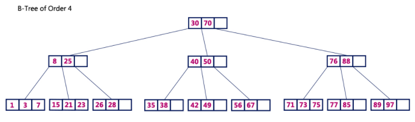
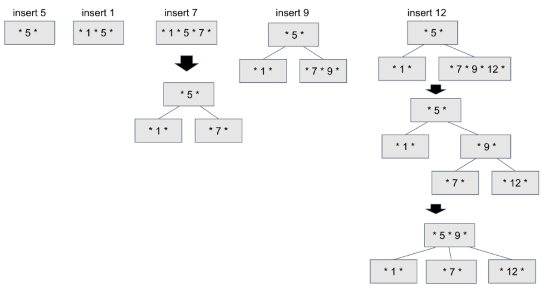
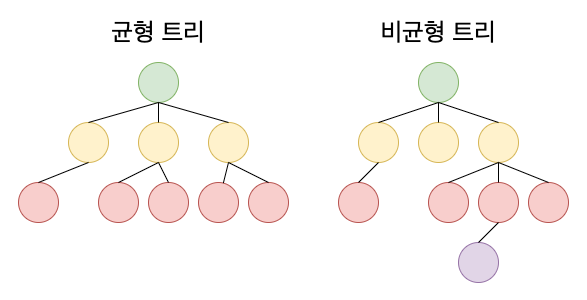
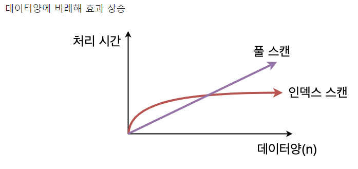
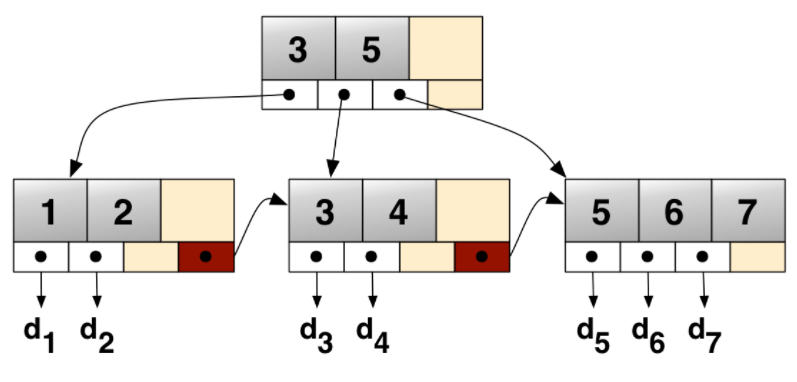
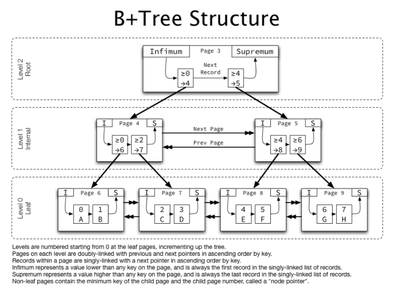
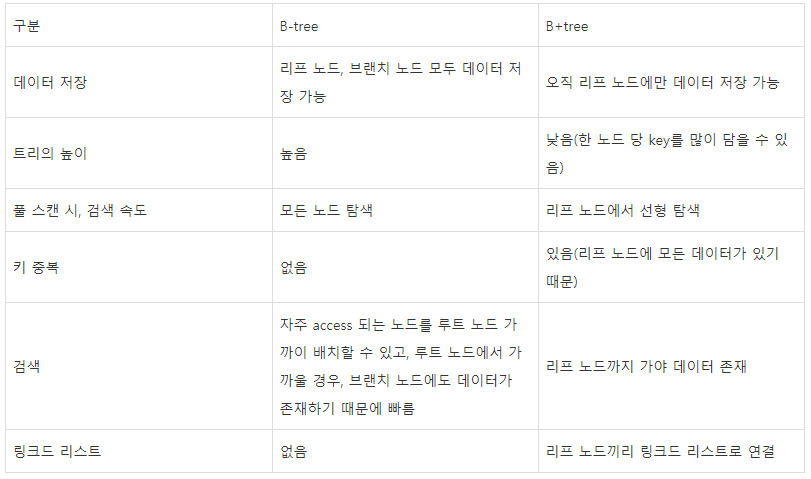

# B-tree & B+tree

- B-tree는 인덱스를 이루고 있는 자료구조의 일종입니다.
- MySQL의 DB engine인 **InnoDB는 B+tree**로 이뤄져있는데, B-tree의 확장된 개념입니다.
  - MySQL은 여러 가지 스토리지 엔진이 제공됩니다. 가장 많이 사용되는 엔진은 **InnoDB**와 **MyISAM**입니다. ( https://ojava.tistory.com/25 )
  - InnoDB는 트랜잭션을 지원합니다. 그렇기 때문에 트랜잭션 세이프 스토리지 엔진입니다.
  - 장점
    - 우수한 성능 : 다수의 사용자가 동시 접속을 할 수 있고, 대용량의 데이터를 처리할 수 있습니다. 데이터 테이블과 인덱스를 테이블 스페이스에 저장을 하고 있고, 테이블 스페이스는 파일과 파티션으로 구성되어 있습니다.
    - 장애 복구 기능 : 단순하게 장애 복구를 하지 않고, 논리적으로 장애 복구를 수행합니다.
    - 데이터 무결성에 대한 보장 : InnoDB의 설계를 할 때, 데이터 무결성에 대해서 중점을 두었습니다.
  - 단점
    - Deadlock 발생 : NODE간의 데이터 체크로 인하여, Deadlock 발생 가능성이 존재합니다.
      - https://mysqldba.tistory.com/54
    - 대용량 처리를 하게 된다면, 순간적으로 많은 자원을 소모합니다.
    - 단순하게 파일 백업으로 복구를 하는게 아니라, 특정한 방법을 사용하여 복구를 수행하기 때문에 데이터를 복구하는데에 어려움이 있습니다.

## B-tree

- 핵심은 데이터가 정렬된 상태로 유지되어 있다는 것입니다.
- Binary search tree와 유사하지만, 한 노드 당 자식 노드가 2개 이상 가능하다. 
- key 값을 이용해 찾고자 하는 데이터를 트리 구조를 이용해 찾는 것입니다.
- 하나의 노드에 많은 수의 데이터를 저장할 수 있습니다.
- 규칙
  - 루트 노드는 적어도 2개 이상의 자식을 가져야 합니다.
  - 노드의 데이터수가 n개라면 자식 노드의 개수는 n+1 개입니다.
  - 각 노드의 자료는 정렬된 상태여야 합니다.
  - Root 노드를 제외한 모든 노드는 적어도 M/2개의 자료를 가지고 있어야 한다.
    - 노드내의 데이터가 1개 이상일수가 있습니다. 노드내 최대 데이터 수가 2개라면 2차 B-Tree, 3개라면 3차 B-Tree 라고 말합니다. ‘1, 2, 3, … M차 B-Tree 라고 합니다.
  - 외부 노드로 가는 경로의 길이는 모두 같아야 합니다. ( 균형 )
  - 입력 자료는 중복 될 수 없습니다.

### 1. 탐색

-  B-Tree 는 이진트리와 마찬가지로 작은 값은 왼쪽 서브트리, 큰 값은 오른쪽 서브트리에 이루어져있습니다.
- 탐색 하고자하는 값을 `root` 노드 부터 시작해 하향식으로 탐색해 나갑니다.

### 2. 삽입

- 3차(홀수) B-Tree 예시

- 초기 삽입시에는 `root` 노드를 생성합니다.

- 데이터를 탐색해 해당하는 `Leaf` 노드에 데이터를 삽입합니다.
  - Leaf노드 데이터가 가득 차 있으면 노드를 분리합니다. 
  - if(노드 데이터 개수 = M(차수))
  - insert7 에서 노드가 1, 5, 7 로 가득찼기 때문에 하위로 분리해줍니다.
- 분리한 서브트리가 B-Tree조건에 맞지 않는다면 부모 노드로 올라가며 merge합니다.
  - insert12 에서 `[9, 7, 12]` 를 서브트리로 분리 하였으나 B-Tree 조건에 맞지 않습니다.
  - Leaf 노드가 모두 같은 레벨에 존재하지 않기 때문에 `Root`노드와 merge로 조건을 만족시켰습니다.

### 3. 장점

-  ''어떤 값에 대해서도 같은 시간에 결과를 얻을 수 있다''인데, 이를 '균일성'이라고 합니다.

- 위의 예시에서 리프노드에 있는 '15'나 '28'을 찾는 시간은 동일할 것입니다.

  - 트리 높이가 다른 경우, 약간의 차이는 있겠지만 O(logN)이라는 시간 복잡도를 구할 수 있다.

- B-tree는 균형트리 입니다.

  

  - 균형트리 : 루트로부터 리프까지의 거리가 일정한 트리 구조를 뜻하는 것으로, 트리 중에서 특히 성능이 안정화 되어있습니다.
  - 하지만 B-tree 처음 생성 당시는 균형 트리이지만 테이블 갱신(INSERT/UPDATE/DELETE)의 반복을 통해 서서히 균형이 깨지고, 성능도 악화됩니다.
  - 어느 정도 자동으로 균형을 회복하는 기능이 있지만, 갱신 빈도가 높은 테이블에 작성되는 인덱스 같은 경우 인덱스 재구성을 해서 트리의 균형을 되찾는 작업이 필요하게 되고 이를 수행합니다.

- 풀 스캔이 테이블의 크기에 비례하는 형태로 실행 시간이 늘어가는데에 비해 인덱스를 사용한 경우 실행 시간의 저하는 보통 원만한 곡선을 그리게 됩니다.

## B+tree

- B+tree는 B-tree의 확장개념으로, **B-tree의 경우**, internal 또는 branch 노드에 key와 data를 담을 수 있습니다.
- 하지만, **B+tree의 경우** 브랜치 노드에 key만 담아두고, data는 담지 않습니다.
- 오직 리프 노드에만 key와 data를 저장하고, 리프 노드끼리 Linked list로 연결되어 있습니다.

### 1. 장점

- 리프 노드를 제외하고 데이터를 담아두지 않기 때문에 메모리를 더 확보함으로써 더 많은 key들을 수용할 수 있습니다.
- 하나의 노드에 더 많은 key들을 담을 수 있기에 트리의 높이는 더 낮아지게 됩니다.
  - cache hit를 높일 수 있습니다.

- 풀 스캔 시, B+tree는 리프 노드에 데이터가 모두 있기 때문에 한 번의 선형탐색만 하면 되기 때문에 B-tree에 비해 빠릅니다.
  -  B-tree의 경우에는 모든 노드를 확인해야 합니다.

### 2. InnoDB에서 사용된 B+tree

- InnoDB에서 B+tree는 단순하게 설명한 B+tree보다 더 복잡하게 구현되어 있습니다.

- 같은 레벨의 노드들끼리는 Linked List가 아닌 Double Linked List를 사용했고, 자식 노드로는 Single Linked List로 연결되어있습니다.

- key의 범위마다 찾아가야할 페이지 넘버(포인터)가 있는데, 해당 페이지 넘버를 통해 곧바로 다음 노드로 넘어갑니다.
- 리프 노드에 다다랐을 때 디스크에 존재하는 데이터의 주소값을 구할 수 있고, Linked List를 통해 탐색도 가능하다. 

- 작동 방식 
  - https://potatoggg.tistory.com/174
  - https://hyungjoon6876.github.io/jlog/2018/07/20/btree.html
- B-Tree을 선택하는 이유 : https://helloinyong.tistory.com/296