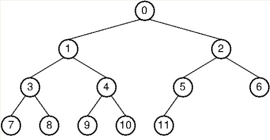
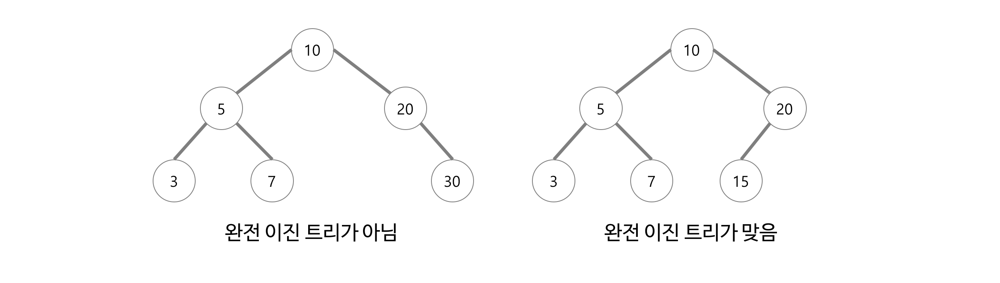
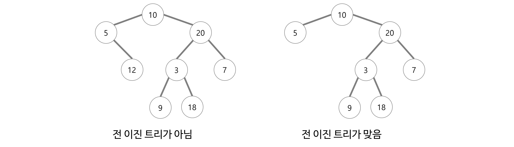

# 트리(Tree)

- 트리는 스택과 큐처럼 선형 구조가 아닌 비 선형 자료구조 입니다.
- 노드로 이루어진 자료구조 입니다. 즉 계층적 관계를 표현하는 자료구조입니다. ( 디렉터리 구조, 조직도 등 )
- 트리는 하나의 루트 노드를 갖습니다.
- 루트 노드는 0개 이상의 자식 노드를 갖고 있습니다.
- 싸이클이 존재하지 않으며 하나의 연결 그래프 입니다.


### 1. 트리를 구성하고 있는 요소


- Node( 노드 ) : 트리를 구성하고 있는 각각의 요소를 의미합니다.
- Edge ( 간선 ) : 노드와 노드를 연결하는 선을 의미합니다.
- Root Node( 루트 노드 ) : 트리 구조에서 최상위에 있는 노드를 의미합니다.
- Terminal Node ( = leaf Node, 단말 노드 ) : 하위에 다른 노드가 연결되어 있지 않은 노드를 의미합니다. 잎새노드라고도 부릅니다.
- Internal Node( 비단말 노드 ) : 단말 노드를 제외한 모든 노드로 루트 노드까지 포합합니다.
- Sibling( 형제 ) : 같은 부모를 가지고 있는 노드를 의미합니다.
- Degree( 노드의 차수 ) : 하위 트리의 개수 / 간선 수 = 각 노드가 지닌 가지의 수를 의미합니다.
- Degree of tree( 트리의 차수 ) : 트리에서 노드의 차수가 가장 높은 차수를 의미 합니다.
- Height( 트리의 높이 ) : 루트 노드에서 가장 깊숙히 있는 노드의 깊이 = ex) 3 ( 최고 레벨을 의미 )


### 2. 트리의 특징

- 그래프의 한 종류로서 최소 연결 트리 라고도 불립니다.

- 트리는 DAG(Directed Acyclic Graphs, 방향성 있는 비순환 그래프)의 한 종류 입니다.

  - 사이클이 존재하지 않습니다.

- 노드가 N개인 트리는 항상 N-1의 간선(Edge)를 가집니다.

- 루트에서 어떤 노드로 가는 경로는 유일합니다.

- 한개의 루트 노드만 존재하며 모든 자식 노드는 한 개의 부모 노드만을 가집니다.

- 순회는 Pre-order, In-order, Post-order로 이루어 집니다.

  

  - 전위 순회(preorder) : Root를 먼저 방문합니다.
    - 0->1->3->7->8->4->9->10->2->5->11->6
  - 중위 순회(inorder) : 왼쪽 하위 트리를 방문 후 뿌리(root)를 방문합니다.
    - 7->3->8->1->9->4->10->0->11->5->2->6
  - 후위 순회(postorder) : 하위 트리 모두 방문 후 뿌리(root)를 방문 합니다.
    - 7->8->3->9->10->4->1->11->5->6->2->0

- 종류는 이진 트리, 이진 탐색트리, 균형 트리(red-black), 이진 힙 등이 있습니다.

  - 균형 트리 : O(log N) 시간에 insert와 find를 할 수 있을 정도로 균형이 잘 잡혀 있는 경우를 의미합니다.


- 트리의 활용
  - 이진 트리인 경우 Linked List로 구현합니다.
  - 인접 배열 이용 ( 2차원 배열 )
    - 개인적으로 최악의 경우 메모리 터지는 경우가 발생
  - 인접 리스트 이용 
    - 가중치가 없는 경우 : ArrayList< ArrayList > list = new ArrayList<>();
    - 가중치가 있는 경우 : ArrayList[] list = new ArrayList[정점의 수 + 1];


# 이진 트리(Binary Tree)

- 각 노드는 최대 2개의 자식을 가지는 트리를 의미합니다. 즉 자식이 1개도 0개도 모두 가능하다는 의미입니다.
- 각각 자식 노드는 자신이 부모의 왼쪽 자식인지 오른쪽 자식인지 지정됩니다. ( 자식이 한명인 경우도 지정해야 합니다. )


### 1. 이진 트리 종류

- 포화 이진 트리( Perfect Binary Tree ) : 모든 레벨에서 노드들이 모두 채워져 있는 트리를 의미합니다.

  

- 완전 이진트리( Complete Binary Tree ) : 마지막 레벨을 제외하고 노드가 모두 채워져 있는 트리를 의미합니다.

  - 마지막 레벨도 다 채워져 있을 수도 있습니다.

  - 왼쪽에서 오른쪽으로 순서대로 차곡차곡 채워져 있어야 합니다.

    

- 정 이진 트리( Full Binary Tree ) : 모든 노드가 0개 혹은 2개의 자식 노드만을 갖는 이진트리를 가르킵니다.

  


### 2. 순회 구현하기 ( 프로그래머스 - 길찾기 게임 )

```java
import java.util.*;
class Solution {
    static ArrayList<node> list;
	static ArrayList<Integer> prelist;
	static ArrayList<Integer> postlist;
	static ArrayList<Integer> inorderlist;
	public static void main(String[] args) {
		int[][] arr = {{5,3},{11,5},{13,3},{3,5},{6,1},{1,3},{8,6},{7,2},{2,2}};
		solution(arr);
	}
    static public int[][] solution(int[][] nodeinfo) {
        int[][] answer = new int[2][nodeinfo.length];
        list = new ArrayList<>();
        prelist = new ArrayList<>();
        postlist = new ArrayList<>();
        inorderlist = new ArrayList<>();
        for (int i = 0; i < nodeinfo.length; i++) {
			list.add(new node(i+1,nodeinfo[i][0], nodeinfo[i][1]));
		}

        //정렬
        Collections.sort(list);

        //연결 노드 만들기
        for (int i = 1; i < list.size(); i++) {
			makeLink(list.get(0), list.get(i));
		}
        
        //전위 순회
        preorder(list.get(0));
        //중위 순회
        inorder(list.get(0));
        //후위 순회
        postorder(list.get(0));
        
        System.out.println(prelist);
        System.out.println(inorderlist);
        System.out.println(postlist);
       
        return answer;
    }
	static void preorder(node n) {
		if(n==null) return;
		
		prelist.add(n.id);
		preorder(n.left);
		preorder(n.right);
	}
	static void inorder(node n) {
		if(n==null) return;
		
		inorder(n.left);
		inorderlist.add(n.id);
		inorder(n.right);
	}
	static void postorder(node n) {
		if(n==null) return;
		
		postorder(n.left);
		postorder(n.right);
		postlist.add(n.id);
	}
	static void makeLink(node root, node n) {
		//x가 같은 노드는 존재하지 않음
		if(n.x<root.x) {
			if(root.left==null) {
				root.left = n; 
				return;
			}
			makeLink(root.left, n);	
		}else {
			if(root.right==null) {
				root.right = n;
				return;
			}
			makeLink(root.right, n);
		}
	}
}
class node implements Comparable<node>{
	int id;
	int x;
	int y;
	node left;
	node right;

	public node(int id, int x, int y) {
		this.id = id;
		this.x = x;
		this.y = y;
	}

	@Override
	public String toString() {
		return "node [id=" + id + ", x=" + x + ", y=" + y + ", left=" + left + ", right=" + right + "]";
	}

	@Override
	public int compareTo(node o) {
		if(this.y==o.y) return this.x-o.x;
		return o.y-this.y;
	}
}
```


