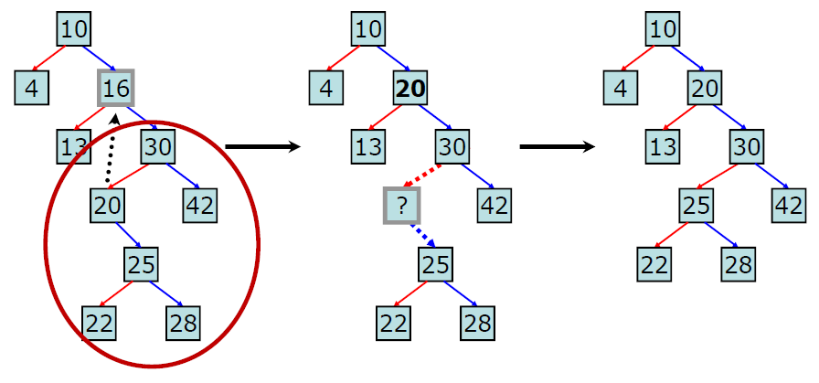
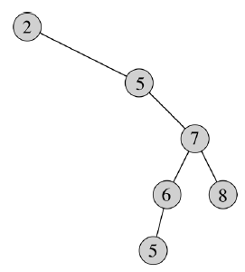

# BST(Binary Search Tree)


- 이진 탐색 트리는 이진 트리의 일종으로서 데이터를 저장하는 규칙이 존재합니다. 그리고 그 규칙은 특정 데이터 위치를 효율적으로 찾을 수 있습니다.
- 이진 탐색과 연결리스트를 결합한 자료구조 입니다. 탐색 능력이 효율적이면서도 자료의 입력과 삭제가 가능합니다.
  - 이진 탐색 : 탐색 소요 시간( O(logN) ), 삽입, 삭제 불가능
  - 연결리스트 : 삽입, 삭제의 시간 복잡도는 O(1), 탐색하는 시간 복잡도 O(N)
- 이진탐색트리를 순회할 때에는 중위순회(inorder) 방식을 주로 사용합니다. 이렇게 해야 모든 값들을 정렬된 순서대로 읽을 수 있습니다. (ex 1 5 6 10 14 17 21)

- 이진 탐색 트리의 4가지 조건
  - 모든 노드의 키(값)는 유일 합니다.
    - 중복이 없어야 하는 이유는 검색이 목적인 자료구조이므로 중복을 넣어 검색 속도를 느리게 할 필요가 없습니다.
  - 왼쪽 서브트리의 모든 키는 루트 노드의 키보다 작습니다.
  - 오른쪽 서브트리의 모든 키는 루트 노드의 키보다 큽니다.
  - 왼쪽과 오른쪽 서브트리도 이진 탐색 트리 입니다.


### 1. 동작 방식

- 탐색(Search)

  - 이미 값들이 정렬되어 있으므로 효율적인 탐색이 가능합니다.
  - 위와 같은 이진 탐색 트리에서 21이라는 키 값을 찾을 때 처음에 루트노드 10과 비교합니다.
  - 21값이 더 크므로 오른쪽 서브트리로 이동하고 또 오른쪽 서브트리의 루트 17과 비교하여 값이 크므로 오른쪽으로 이동합니다.
  - 시간복잡도는 트리의 높이(루트노드 ~ 잎새노드)가 h일 때 O(h)가 됩니다. 최악의 경우 잎새노드까지 탐색해야하기 때문입니다.

- 삽입(Insert)

  - 삽입은 BST의 조건을 깨지 않기 위해서는 단말노드에 값을 추가해야 합니다. ( 서브트리의 속성 )
    - 즉 반드시 삽입 연산은 잎새노드에서 이뤄지게 됩니다.
  - 만약 12를 추가한다면 루트노드 10과 비교했을 때 12가 더 크므로 오른쪽 서브 트리로 이동합니다. 오른쪽 서브트리의 루트노드 17과 비교하였을 때 더 작으므로 왼쪽 서브트리로 이동합니다. 왼쪽 서브트리의 루트노드 14와 비교했을 때 12가 더 작으므로 왼쪽 서브트리의 루트노드로 연결되어집니다.
  - 시간복잡도는 트리의 높이(루트노드 ~ 잎새노드)가 h일 때 O(h)가 됩니다. 삽입할 위치의 잎새노드 까지 찾아 내려가는데 h번 비교해야 되기 때문 입니다. 물론 삽입이라는 계산이 추가되어야지만 연결리스트로 구현되어 있기 때문에(O(1))은 무시합니다.

- 삭제(Delete) : 삭제는 3가지 경우로 나눠집니다.

  - 삭제할 노드의 자식 노드가 없을 때

    - 단순하게 부모 노드와 링크를 끊어주면 됩니다. 자바는 GC가 알아서 메모리를 회수해주므로 링크를 끊어주면 되지만 C/C++은 free() 사용해서 메모리를 회수해줘야 한다고 합니다.

  - 삭제할 노드의 자식노드가 하나 존재할 때

    - 삭제되는 노드의 자식과 부모 노드를 연결만 시켜주면 됩니다.

  - 삭제할 노드의 자식노드가 두개 있을 때

    - 오른쪽 자식 노드의 가장 작은 값 or 왼쪽 자식 노드의 가장 큰 값 중 하나만 올려서 제거해주면 됩니다.
    - 이진 탐색 트릐의 조건을 만족시키려면 당연한 이유인 것 같습니다.

    

    -  시간 복잡도는 트리의 높이가 h이고 삭제대상 노드의 레벨이 d라고 가정할 때 삭제  대상의 노드의 오른쪽 서브트리를 찾는 d번의 연산이 필요합니다. 또한 오른쪽 서브트리에서 가장 작은 값을 찾기 위해서는 h-d에 해당하는 연산이 필요합니다. 즉 시간복잡도는 O(d+h-d) = O(h)가 됩니다.


### 2. 한계점

- BST는 삽입, 삭제, 탑색과정에서 모두 트리의 높이만큼 탐색하므로 O(logN)의 시간 복잡도를 가지지만 트리가 편향되어지는 편향트리가 될 수가 있습니다. 이 때에는 배열과 같으므로 시간 복잡도는 O(N)이 됩니다.



- 이를 해결하기 위해 트리 전체의 균형을 맞춰주는 이진탐색트리 일종인 AVL Tree( 스스로 균형을 맞추는 이진탐색트리 ), Red-Black Tree가 있습니다.
  - 균형을 잡기 위한 트리구조의 재조정인 Rebalancing 기법을 사용합니다. 그 중 하나가 Red-Black Tree 입니다.


### 3. 구현하기

```java
import java.util.*;
class Solution {
	public static void main(String[] args) {
		BinaryTree tree = new BinaryTree();
        tree.insertNode(5);
        tree.insertNode(8);
        tree.insertNode(7);
        tree.insertNode(21);
        tree.insertNode(10);
        tree.insertNode(9);
        tree.insertNode(11);

        tree.inorderTree(tree.rootNode, 0);
        
        System.out.println();
        
        tree.removeNode(7);
        tree.inorderTree(tree.rootNode, 0);

	}
}
class Node {
	int value;
	Node leftChild;
	Node rightChild;
	
	public Node(int value) {
        this.value = value;
        this.leftChild = null;
        this.rightChild = null;
    }

	@Override
	public String toString() {
		return "Node [value=" + value + ", leftChild=" + leftChild + ", rightChild=" + rightChild + "]";
	}
	
	
}
class BinaryTree {
	Node rootNode = null;
	
	public void inorderTree(Node root, int depth) {
		if(root != null) {
			inorderTree(root.leftChild, depth+1);
			System.out.print(root.value+" ");
			inorderTree(root.rightChild, depth+1);
		}
	}
	
	public void insertNode(int element) {
		
		// 루트노드가 없을 경우
		if(rootNode == null) {
			rootNode = new Node(element);
		}else {
			Node head = rootNode;
			Node currentNode;
			
			while(true) {
				currentNode = head;
				
				// 현재의 루트보다 작은 경우, 왼쪽을 탐색합니다.
				if(head.value > element) {
					
					// 서브트리의 루트노드 갱신
					head = head.leftChild;
					
					// 만약 왼쪽 자식 노드가 없으면 해당 위치에 바로 삽입합니다.
					if(head == null) {
						currentNode.leftChild = new Node(element);
						break;
					}
				}else { // 현재의 루트보다 큰 경우, 오른쪽을 탐색합니다.
					head = head.rightChild;
					
					// 만약 오른쪽 자식 노드가 없으면 해당 위치에 바로 삽입합니다.
					if(head == null) {
						currentNode.rightChild = new Node(element);
						break;
					}
					
				}
			}
		}
	}
	
	public boolean removeNode(int element) {
		
		Node removeNode = rootNode;
        Node parentOfRemoveNode = null;
        
        // 삭제할 대상을 찾아갑니다. 발견하면 종료합니다.
        while(removeNode.value != element){
        	
        	// 삭제하는 노드의 부모를 계속 갱신해줍니다.
        	parentOfRemoveNode = removeNode;
        	
        	// 삭제할 값이 현재 루트 노드보다 작으면 왼쪽을 탐색
        	if(removeNode.value > element) {
        		removeNode = removeNode.leftChild;
        	}else {
        	// 삭제할 값이 현재 루트 노드보다 크면 오른쪽 탐색
        		removeNode = removeNode.rightChild;
        	}
        	
        	if(removeNode == null) {
        		return false;
        	}
        }
        
        // 자식 노드가 모두 없는 경우
        if(removeNode.leftChild!=null && removeNode.rightChild!=null) {
        	// 삭제하는 노드가 루트 노드 일 때
        	if(removeNode == rootNode) {
        		rootNode = null;
        	// 지워지는 노드가 부모의 왼쪽 일 때	
        	}else if(parentOfRemoveNode.leftChild==removeNode) {
        		parentOfRemoveNode.leftChild = null;
        	// 지워지는 노드가 부모의 오른쪽 일 때	
        	}else {
        		parentOfRemoveNode.rightChild = null;
        	}
        }
        // 자식이 하나만 존재하는 경우 ( 2가지 )
        // 오른쪽 자식 노드만 존재하는 경우
        else if(removeNode.leftChild == null) {
        	// 삭제하는 노드가 루트 노드일 경우
        	if(removeNode == rootNode) {
        		//그의 오른쪽 자식을 루트 노드로 옮겨줍니다.
        		rootNode = removeNode.rightChild;
        	// 지워지는 노드가 부모의 오른쪽 노드 인경우
        	}else if(removeNode == parentOfRemoveNode.rightChild) {
        	    // 부모의 오른쪽 노드에 지워지는 오른쪽 자식을 연결해줍니다.
        		parentOfRemoveNode.rightChild = removeNode.rightChild;
        	}else { // 지워지는 노드가 부모의 왼쪽 노드인 경우
        	    // 부모의 왼쪽 노드에 지워지는 오른쪽 자식을 연결해줍니다.
        		parentOfRemoveNode.leftChild = removeNode.rightChild;
        	}
        }
        
        // 왼쪽 자식 노드만 존재하는 경우
        else if(removeNode.rightChild == null) {
        	// 삭제하는 노드가 루트 노드일 경우
        	if(removeNode == rootNode) {
        		//그의 오른쪽 자식을 루트 노드로 옮겨줍니다.
        		rootNode = removeNode.rightChild;
        	// 지워지는 노드가 부모의 오른쪽 노드 인경우
        	}else if(removeNode == parentOfRemoveNode.rightChild) {
        	    // 부모의 오른쪽 노드에 지워지는 왼쪽자식을 연결해줍니다.
        		parentOfRemoveNode.rightChild = removeNode.leftChild;
        	}else { // 지워지는 노드가 부모의 왼쪽 노드인 경우
        	    // 부모의 왼쪽 노드에 지워지는 왼쪽 자식을 연결해줍니다.
        		parentOfRemoveNode.leftChild = removeNode.leftChild;
        	}
        }
        
        // 두개의 자식 노드가 모두 존재하는 경우
        // 왼쪽 서브트리의 가장 큰 값 노드를 올리거나 오른쪽 서브 트리에 있는 가장 작은 값 노드를 올리면 됩니다.
        // 여기서는 오른쪽 서브트리의 가장 작은 값 노드를 올려줍니다.
        else {
        	// 1. 삭제 대상 노드의 자식 노드 중에서 대체될 가장 작은 노드를 찾습니다.
        	Node parentReplaceNode = removeNode;
        	Node replaceNode = parentReplaceNode.rightChild;
        	
        	// 가장 왼쪽 자식이 작은 값이므로 null이 나오기 까지 찾아줍니다.
        	while(replaceNode.leftChild != null) {
        		parentReplaceNode = replaceNode;
        		replaceNode = replaceNode.leftChild;
        	}
        	
        	// 2. 지울 노드의 오른쪽 자식이 바꿀 노드가 아닐 경우는 이어주는 작업을 진행해줘야 합니다. ( 핵심 )
        	if( replaceNode != removeNode.rightChild ) {
        		
        		// 바꿀 노드의 부모 왼쪽에 바꿀 노드의 오른쪽 자식을 넣어줍니다.
        		// 바꿀 노드의 왼쪽자식은 존재하지 않습니다. ( 이미 가장 작은 값이기 때문에 )
        		parentReplaceNode.leftChild = replaceNode.rightChild;
        		
        		// 바꿀 노드의 오른쪽 자식 노드에 삭제할 노드의 오른쪽 자식을 붙여줍니다.
        		replaceNode.rightChild = removeNode.rightChild;
        	}
        	
        	// 3. 바꿀노드를 지울 노드와 교체해줍니다.
        	if(removeNode == rootNode) {
        		rootNode = replaceNode;
        	}else if (removeNode == parentOfRemoveNode.rightChild) {
                parentOfRemoveNode.rightChild = replaceNode;
            } else {
                parentOfRemoveNode.leftChild = replaceNode;
            }
        	
        	// 4. 마지막으로 삭제 대상의 왼쪽 자식을 붙여줍니다.
        	replaceNode.leftChild = removeNode.leftChild;
        	
        }
		
		return true;
	}
	
}
```


### 4. 트리가 BST 트리인지 확인하는 알고리즘

- 왼쪽 자식 노드가 루트보다 작고, 오른쪽 자식 노드가 루트보다 큰지 확인해야 합니다.

- 왼쪽 서브트리의 최대값이 루트보다 작고, 오른쪽 서브트리의 최솟값이 루트보다 작아야 합니다.

- 이 2가지 조건을 재귀를 통해 확인할 수 있습니다.

- Preoder 방식을 이용합니다. ( 루트 노드부터 탐색 )

  ```java
  checkBST(tree.rootNode, Integer.MIN_VALUE, Integer.MAX_VALUE))
  
  static boolean checkBST(Node node, int min, int max) {
  		
  		if(node.value > max || node.value < min) {
  			return false;
  		}
  		
  		if(node.leftChild!=null && checkBST(node.leftChild, min, node.value) == false) {
  			return false;
  		}
  		
  		if(node.rightChild!=null && checkBST(node.rightChild, node.value, max) == false) {
  			return false;
  		}
  	
  		return true;
  	}
  ```

  