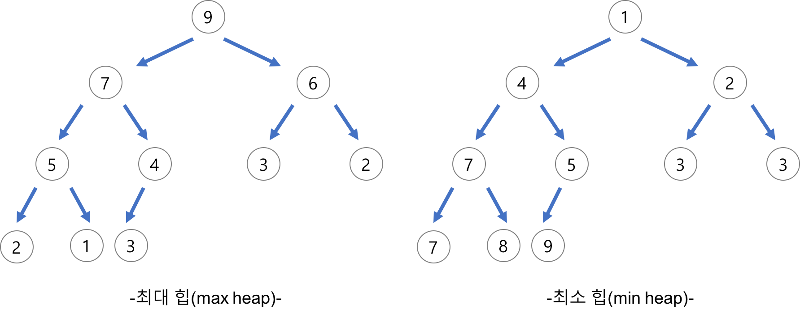

# Heap (자료구조)

- 우선순위 큐
  - 시뮬레이션 시스템
  - 네트워크 트래픽 제어
  - 운영 체제에서의 작업 스케쥴링
  - 수치 해석학적인 계산
- 우선순위 큐는 배열, 연결리스트, 힙으로 구현이 가능하다고 한다. 여기서 힙을 사용하면 가장 효율적이다.
  - 삽입, 삭제(logN)



- 힙이란 ?
  - 완전 이진 트리의 일종으로 우선순위 큐를 위해 만들어진 자료구조 이다.
  - 여러개의 값들 중 최댓값이나 최소값을 빠르게 찾아내는 자료구조이다.
  - 반 정렬 상태(느슨한 상태)를 유지한다.
    - 부모 노드의 키 값이 자식 노드의 키값보다 항상 큰(작은) 이진 트리이다.
  - 중복된 값을 허용한다.( 원래 이진 탐색 트리는 중복 허용 x)
- 힙 종류
  - 최대 힙
    - 부모 노드의 키 값이 자식 노드의 키 값보다 크거나 같은 완전 이진 트리
  - 최소 힙
    - 부모 노드의 키 값이 자식 노드의 키 값보다 작거나 같은 완전 이진 트리
- 힙 구현
  - 배열을 이용한다.
  - 왼쪽 자식의 인덱스 = 부모 인덱스 * 2
  - 오른쪽 자식의 인덱스 = 부모 인덱스 * 2 + 1
  - 부모의 인덱스 = 자식의 인덱스 / 2
- 코드 구현
  - 삽입 : 맨 마지막 자식에 넣고 위로 비교하면서 정렬을 시도
  - 삭제 : root를 꺼내고 맨마지막 자식을 root로 올려서 정렬을 밑으로 시도한다.
-  최소힙

```java
class minHeap{
	
	private ArrayList<Integer> heap;
	
	public minHeap() {
		heap = new ArrayList<>();
		heap.add(0);
	}
	
	//삽입
	public void insert(int val) {
        // 마지막에 삽입
		heap.add(val);
		int p = heap.size()-1;
		
		while(p > 1 && heap.get(p) < heap.get(p/2)) {
			
			int temp = heap.get(p/2);
			heap.set(p/2, heap.get(p));
			heap.set(p, temp);
			
			p/=2;
		}
	}
	
	//삭제
	public int delete() {
		if(heap.size()-1 < 1) return 0;
		
		int deleteItem = heap.get(1);
		
		//가장 마지막원소를 root로!
		heap.set(1, heap.get(heap.size()-1));
		heap.remove(heap.size()-1);
		
		int index = 1;
		while(index*2 < heap.size()) {
			
            //왼쪽 자식 구하기
			int child = heap.get(index*2);
			int childIndex = index*2;
            
			//자식 2개 중 더 작은 것이 무엇인지 판단해줍니다.
			if((childIndex+1 < heap.size()) && child > heap.get(childIndex+1)) {
				child = heap.get(childIndex+1);
				childIndex += 1;
			}
			
            // 이미 root가 자기 자식보다 작으면 진행하지 않는다.
			if(heap.get(index)<child) break;
			
            // 바꿔줍니다.
			int temp = heap.get(index);
			heap.set(index, heap.get(childIndex));
			heap.set(childIndex, temp);
			index = childIndex;
		}
		
		return deleteItem;
	}
	
}

```


- 최대힙

```java
class maxheap{
	ArrayList<Integer> heap;
	
	public maxheap() {
		this.heap = new ArrayList<>();
		heap.add(0);
	}
	
	public void insert(int val) {
		heap.add(val);
		int p = heap.size()-1;
		
		while(p>1 && heap.get(p)>heap.get(p/2)) {
			
			int temp = heap.get(p);
			heap.set(p, heap.get(p/2));
			heap.set(p/2, temp);
			p/=2;
			
		}
	}
	
	public int delete() {
		if(heap.size()-1 < 1) return 0;
		
		int deleteItem = heap.get(1);
		
		heap.set(1, heap.get(heap.size()-1));
		heap.remove(heap.size()-1);
		
		int index = 1;
		while(index*2 < heap.size()) {
			
			int child = heap.get(index*2);
			int maxIndex = index*2;
			
			if(maxIndex+1 < heap.size() && child < heap.get(maxIndex+1)) {
				child = heap.get(maxIndex+1);
				maxIndex+=1;
			}
			
			if(heap.get(index)>child) break;
			
			int temp = heap.get(index);
			heap.set(index, heap.get(maxIndex));
			heap.set(maxIndex, temp);
			
			index = maxIndex;
			
		}
		
		return deleteItem;
	}
}
```

