# 레드 블랙 트리

- 기존 이진탐색트리는 저장과 검색에 평균 O(logn)시간이 소요되지만 최악의 경우 트리의 모양이 균형을 잘 이루지 못해서 O(n)에 근접한 시간이 소요될 수도 있습니다. 그래서 이를 방지하기 위해 균형잡힌 이진 검색트리가 레드 블랙 트리입니다.
- 기존 이진탐색트리에서 노드들이 편향되지 않기 위해 조건들 생성했습니다.
- 레드나 블랙이라는 색상 속성을 가지고 있는 이진 탐색 트리입니다.
- 레드-블랙 트리는 개략적으로 균형이 잡혀 있기 때문에 삽입, 삭제, 검색시 최악의 경우에서의 시간복잡도가 트리의 높이(또는 깊이)에 따라 결정되기 때문에 보통의 이진 탐색 트리에 비해 효율적이라고 할 수 있습니다.
-  Collection에서 ArrayList의 내부적인 알고리즘이 RBT로 이루어져 있습니다.
-  Map에서 HashMap의 Separate Chaining(충돌 처리 기법 중 하나, LinkedList로 Hash 충돌을 해결하는 방법)에서 사용됩니다.
- 잎 노드들은 모두 NLI로 표시되어 있고 아무ㄷ 데이터도 가지고 있지 않지만 색깔만 검은색인 더미 노드를 의미합니다. (구현해 용이하기 위해서)

### 1. 특성

- 노드는 레드 혹은 블랙 중 하나입니다.

- 루트 노드는 블랙입니다.

- 모든 널 포인터는 블랙입니다. ( 자식이 없는 노드==리프노드==NIL노드==아무것도 없는 노드 )

- 레드 노드의 자식노드 양쪽은 언제나 모두 블랙입니다. 

  - 즉 레드 노드는 연달아 나타날 수 없으며, 블랙 노드만이 레드 노드의 부모 노드가 될 수 있습니다.
  - 블랙노드의 자식은 레드 or 블랙 다 가능합니다.

- 어떤 노드로부터 시작되어 리프 노드에 도달하는 모든 경로에는 리프 노드(자식없는)를 제외하면 모두 같은 개수의 블랙 노드가 있습니다.

  - 이 특성 때문에 모든 경로에 대해 최장 경로의 거리는 최단 경로의 거리의 두배 이상이 될 수 없습니다. 그래서 균형이 잡혀지는거죠! ( 가장 짧은 조건은 검정노드만 있고 가장 긴 노드는 빨강과 검정의 반복 )

  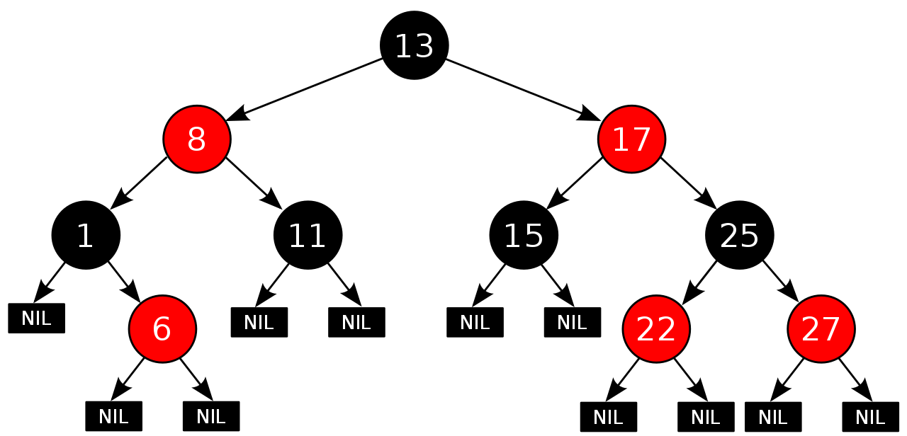


### 2. 삽입

- 삽입되는 노드의 색깔은 무저건 레드 입니다. 여기서 삽입할 때 발생하는 **Double Red**의 오류가 생기게 되는데 이것을 해결하면 됩니다.

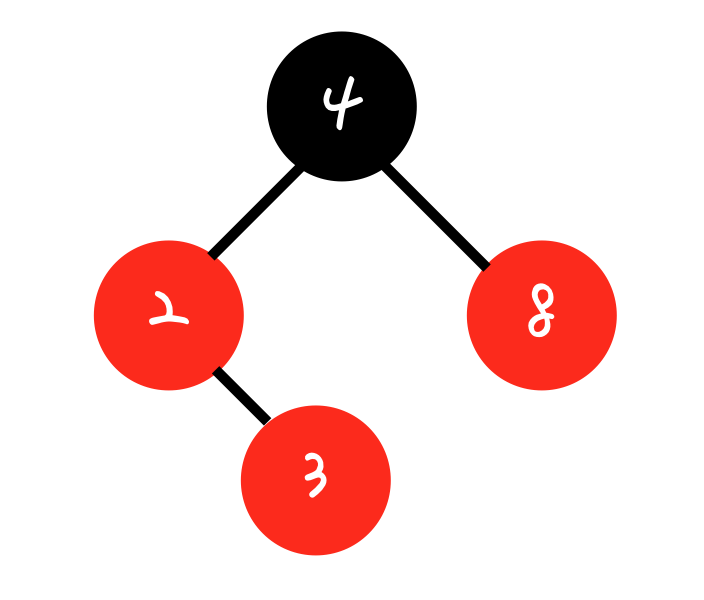

- Double Red를 해결하는 방법은 2가지가 있습니다.
  - Restructuring : uncle node가 블랙일 때
  - Recoloring : uncle node가 레드일 때
- 현재 Insert된 노드의 uncle node의 색깔에 따라 수행하는 방법이 달라지게 됩니다.

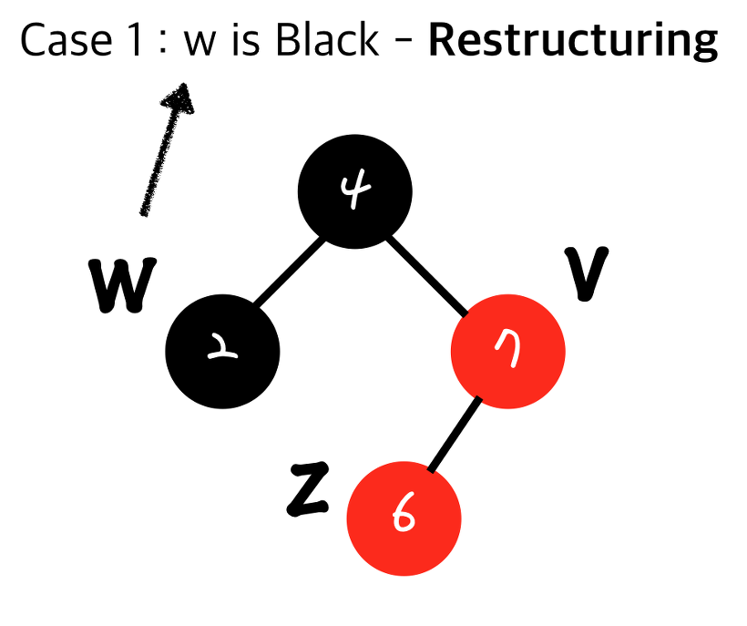

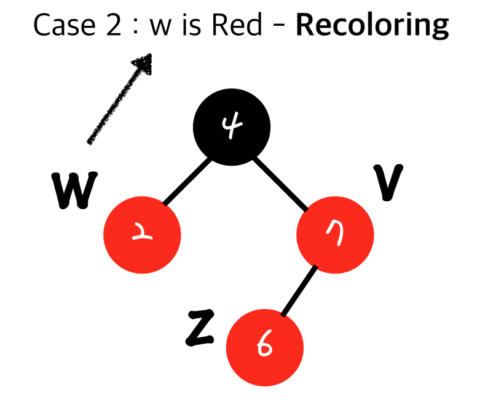


### Restructuring 

- 현재 Insert된 노드와 내 부모, 내 부모의 부모를  가지고 진행합니다.

  - 나와 내 부모, 내 부모의 부모를 오름차순으로 정렬합니다.
  - 무조건 가운데 있는 값을 부모로 만들고 나머지 두리을 자식으로 만듭니다.
  - 올라간 가운데 있는 값을 블랙으로 만들고 두 자식을 레드로 만듭니다.

  

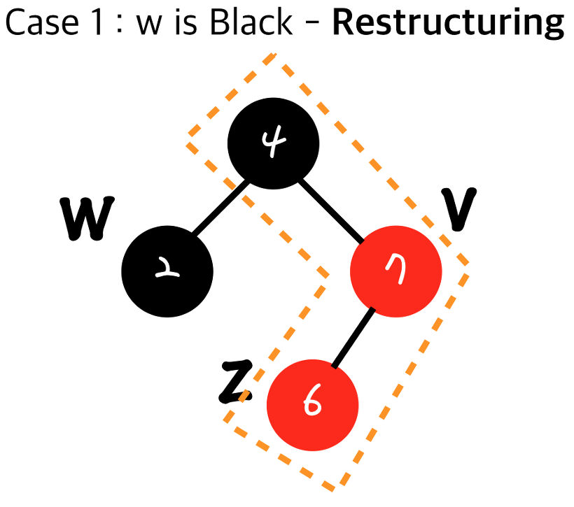

- 나와 내 부모, 부모의 부모를 선택합니다.

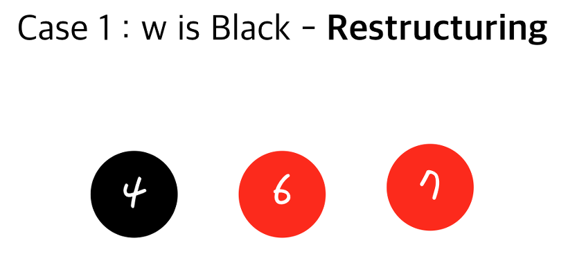

- 오름차순으로 정렬합니다.

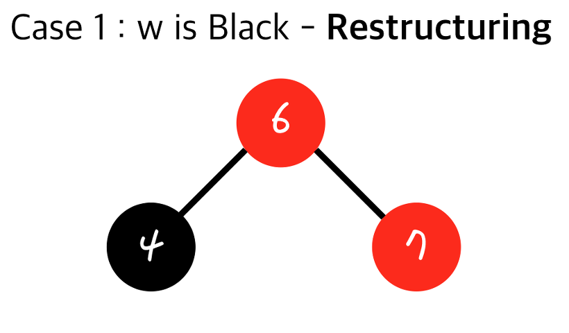

- 가운데를 부모로 두고 자식으로 이어줍니다. ( 자동으로 이진 탐색 트리 생성 )

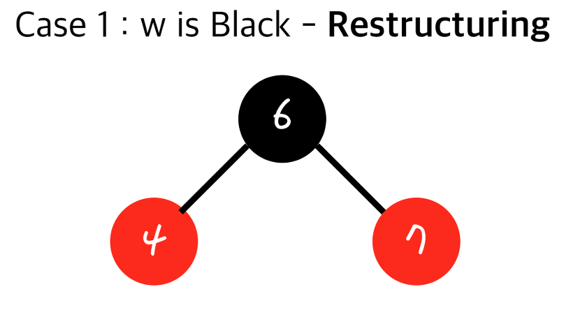

- 마지막으로 부모를 블랙으로 만들고 자식 2개를 레드로 만듭니다.( 레드 블랙 트리 조건 )

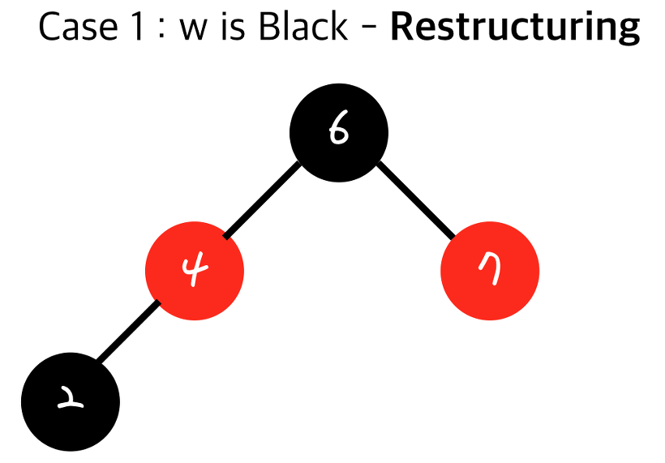

- 4의 자식이었던 uncle 노드를 그대로 자식에 추가해줍니다.( 조건 자동으로 만족 )


- 시간복잡도 
  - 다른 서브트리에 영향을 끼치지 않기 때문에(Black Depth가 변동이 없습니다) 한번에 **Restructuring**이 끝납니다. ( O(1) )
  - 히지만 어떤 노드를 insert를 먼저 하고 **Restructuring**가 일어나므로 총 수행시간은 O(logn)입니다. 즉 지금 현재 노드가 들어갈 위치를 먼저 찾아야 하기 때문입니다.


### Recoloring

- 현재 Insert된 노드의 부모와 그 형제를 블랙으로 만들고 부모의 부모를 레드로 만듭니다.
  - 전과 후가 모두 Black Depth가 동일해집니다.
- 내 부모의 부모가 Root node가 아니면 다시 **Double Red**가 발생하게 됩니다.


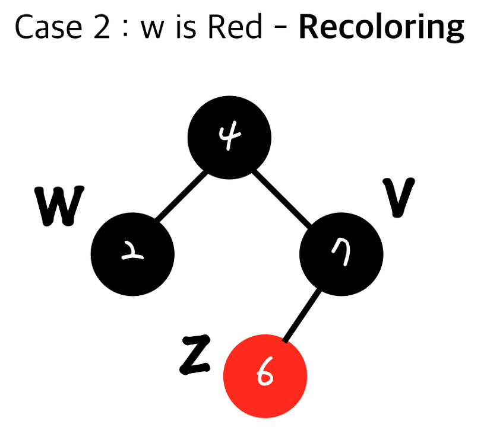

- 부모와 그 형제를 블랙으로 만들어 줍니다.

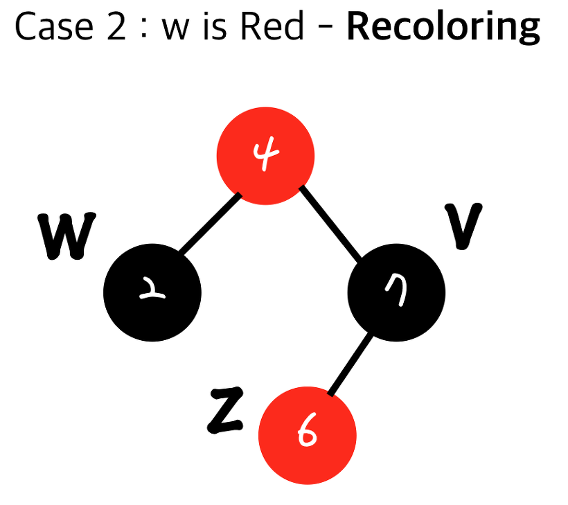

- 부모의 부모를 빨강으로 만들어 줍니다.
- 여기서 만약에 내 부모의 부모가 Root Node였다면 레드 블랙 트리의 1번 조건 때문에 블랙이 되어야 합니다.


- 근데 내 부모의 부모가 Root Node가 아니면?? **Double Red**가 발생하게 됩니다. 이유는 내 부모의 부모의 부모가 레드일 수도 있기 때문입니다. 여기서 **Double Red**가 또 발생하였으니 **uncle node**(4의 부모의 형제노드)를 보고 **Restructuring** or **Recoloring** 결졍해주면서 계속 변경해주면 됩니다. 그래서 최악의 경우 **Root**까지 가는 경우가 생기게 됩니다.
- 여기서 알 수 있는 점은 **Restructuring**은 다른 서브트리에 영향을 끼치지 않습니다. 그래서 **Double Red**가 발생하지 않고 한번에 끝낼 수 있습니다. 하지만 **uncle node**의 색깔이 레드여서 **Recoloring** 을 하게 되면 다시 **Double Red**가 생길 수 있기 때문에 언제 끝날지는 계속 탐색을 해봐야 합니다.

- 시간복잡도 
  - 다른 서브트리에 영향을 끼치지 않기 때문에(Black Depth가 변동이 없습니다) 한번에 **Recoloring** 이 끝납니다. ( **O(1)** )
  - 하지만 최악의 경우 **Root**까지 가야하므로 **O(logn)**이 걸리게 됩니다.
  - 이것도 마찬가치로 어떤 노드를 insert를 먼저 하고 **Recoloring** 가 일어나므로 총 수행시간은 **O(logn)**입니다. 즉 지금 현재 노드가 들어갈 위치를 먼저 찾아야 하기 때문입니다.
  - 그래서 최종적으로 **O(logn)** 입니다.
- 결론 : 우선 BST 의 특성을 유지하면서 노드를 삽입을 합니다.. 그리고 삽입된 노드의 색깔을 **RED 로** 지정한다. Red 로 지정하는 이유는 Black-Height 변경을 최소화하기 위함입니다. 삽입 결과 RBT 의 특성 위배(violation)시 노드의 색깔을 조정하고, Black-Height(어느 경로든 모두 같은 블랙 노드 수) 가 위배되었다면 rotation 을 통해 height 를 조정합니다. 이러한 과정을 통해 RBT 의 동일한 height 에 존재하는 internal node 들의 Black-height 가 같아지게 되고 최소 경로와 최대 경로의 크기 비율이 2 미만으로 유지된다.


### 3. 구현하기 ( 삽입 )

### 1) 구현하기 전에

- 회전 : 부모와 지식 노드의 위치를 바꾸는 것을 의미합니다.

  - 방향에 따라 우회전과 좌회전으로 나누어집니다.
  - 우회전 : 왼쪽 자식과 위치를 바꾸는 것을 의미
  - 좌회전 : 오른쪽 자식과 위치를 바꾸는 것을 의미

  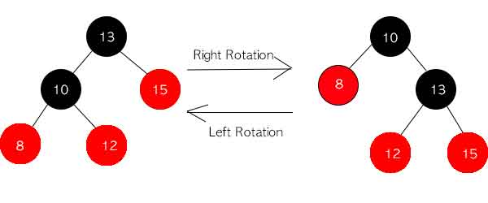

- 단순하게 바꾸면 이진 탐색 트리 조건과 레드 블랙 트리 조건이 깨지게 됩니다.
- 그래서 특수한 처리를 바탕으로 구현해야합니다.
  - 우회전 : 왼쪽 자식의 노드의 오른쪽 자식 노드를 부모 노드의 왼쪽 자식으로 연결시켜줍니다.
  - 좌회전 : 오른쪽 자식 노드의 왼쪽 자식 노드를 부모 노드의 오른쪽 자식으로 연결시켜줍니다.


### 2) 구현해보기

- 앞서 레드 블랙 트리의 조건중 모든 조건은 쉽게 만족할 수 있지만 4번 조건은 쉽게 만족할 수 없습니다.

  - 이 조건이 위반되었다는 것은 삽입한 노드와 부모 노드의 색이 모두 빨간색이라는 사실입니다.

  - 그 경우가 또 총 3가지로 나뉘게 됩니다.

    - 1.삼촌도 빨간색인 경우 = recoloring
    - 2.삼촌이 검은색이며 새로 삽입한 노드가 부모 노드의 오른쪽 자식인 경우 : 부모 노드를 왼쪽으로 회전시켜 3번의 상황으로 바꿔줘야 합니다. 그 다음 3번을 진행합니다.

    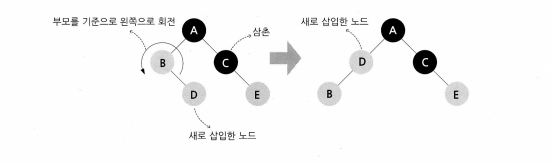

    - 3.삼촌이 검은색이며 새로 삽입한 노드가 부모 노드의 왼쪽 자식인 경우 : 부모 노드를 검은색, 할아버지 노드를 빨간색으로 칠한 후 할아버지 노드를 오른쪽으로 회전시킵니다.

    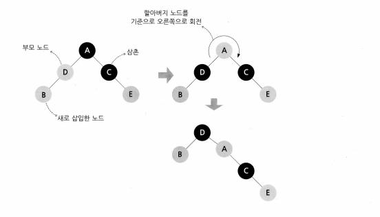

- 소스코드

```java
class RedBlackTree {
	int BLACK = 0;
	int RED = 1;
	
	Node root;
	
	class Node{
		
		int value;
		int color;
		
		Node left;
		Node right;
		Node parent;
		
		public Node(int value) {
			this.value = value;
			this.color = BLACK;
			this.left = null;
			this.right = null;
			this.parent = null;
		}
		
		Node() {
			this(-1);
		}

		public String getColor() {
			return color == RED ? "RED" : "BLACK";
		}

		public void setColor(int color) {
			this.color = color;
		}
		
	}
	
	public void printTree(Node node) {
		if (node == null)
			return;

		System.out.println(node.value + "(" + node.getColor() + ")");
		printTree(node.left);
		printTree(node.right);
	}
	
	public void insertNode(int v) {
		
		// 루트노드가 없을 경우
		if(root == null) {
			root = new Node(v);
		}else {
			Node head = root;
			Node currentNode;
			Node node = new Node(v);
			node.setColor(RED);
			
			while(true) {
				currentNode = head;
				
				// 현재의 루트보다 작은 경우, 왼쪽을 탐색합니다.
				if(head.value > node.value) {
					
					// 서브트리의 루트노드 갱신
					head = head.left;
					
					// 만약 왼쪽 자식 노드가 없으면 해당 위치에 바로 삽입합니다.
					if(head == null) {
						currentNode.left = node;
						node.parent = currentNode;
						break;
					}
				}else { // 현재의 루트보다 큰 경우, 오른쪽을 탐색합니다.
					head = head.right;
					
					// 만약 오른쪽 자식 노드가 없으면 해당 위치에 바로 삽입합니다.
					if(head == null) {
						currentNode.right = node;
						node.parent = currentNode;
						break;
					}
					
				}
			}
			
			recolorTree(node);
		}
	}
	//1.삼촌도 빨간색인 경우 = recoloring
	//2.삼촌이 검은색이며 새로 삽입한 노드가 부모 노드의 오른쪽 자식인 경우 = 부모 노드를 왼쪽으로 회전시켜 3번의 상황으로 바꿉니다.
	//3.삼촌이 검은색이며 새로 삽입한 노드가 부모 노드의 왼쪽 자식인 경우 = 부모노드를 검은색, 할아비지 노드를 빨간색으로 칠 한후
	//할아버지 노드를 오른쪽으로 회전시킵니다.
	private  void recolorTree(Node node) {
		//부모 노드가 빨간색일 경우 무한 반복
		while(node.parent != null && "RED".equals(node.parent.getColor())) {
			Node next = null;
			
			//삽입된 노드의 부모의 형제노드가 오른쪽인 경우
			if(node.parent == node.parent.parent.left) {
				next = node.parent.parent.right;
				
				//uncle node가 레드 일 경우 recoloring 실행
				if(next != null && "RED".equals(next.getColor())) {
					//insert된 부모와 그 형제를 블랙으로 만들고 부모의 부모를 레드로 만듭니다.
					node.parent.setColor(BLACK);
					next.setColor(BLACK);
					node.parent.parent.setColor(RED);
					
					//recoloring을 실행했으니 끝낼 수 있는지 판단해야 합니다.
					node = node.parent.parent;
					continue;
				}
				
				//uncle node가 블랙 일 경우 recoloring 실행
				
				//오른쪽 자식으로 추가된 경우
				if(node == node.parent.right) { //내가 부모의 오른쪽 자식일 경우
					node = node.parent;
					rotateLeft(node);
				}
				
				//부모를 검은색으로 변경
				node.parent.setColor(BLACK);
				//할아버지 노드를 빨간색으로 변경
				node.parent.parent.setColor(RED);
				
				rotateRight(node.parent.parent);
				break;
					
		    //삽입된 노드의 부모의 형제노드가 왼쪽인 경우
			}else {
				next = node.parent.parent.left;
				
				if (next != null && "RED".equals(next.getColor())) {
					node.parent.setColor(BLACK);
					next.setColor(BLACK);
					node.parent.parent.setColor(RED);
					node = node.parent.parent;
					continue;
				}
				
				if (node == node.parent.left) {
					node = node.parent;
					
					rotateRight(node);
				}
				
				node.parent.setColor(BLACK);
				node.parent.parent.setColor(RED);
				
				rotateLeft(node.parent.parent);
				break;
			}
		}
		root.setColor(BLACK);
	}
	private void rotateLeft(Node node) {
		if (node.parent == null) {
			Node right = root.right;
			root.right = root.right.left;
			right.left = new Node();
			right.left.parent = root;
			root.parent = right;
			right.left = root;
			right.parent = null;
			root = right;
		}
		else {
			if (node == node.parent.left)
				node.parent.left = node.right;
			else
				node.parent.right = node.right;
			
			node.right.parent = node.parent;
			node.parent = node.right;
			
			if (node.right.left != null)
				node.right.left.parent = node;
			
			node.right = node.right.left;
			node.parent.left = node;
		}
	}
	private void rotateRight(Node node) {
		if (node.parent == null) {
			Node left = root.left;
			root.left = root.left.right;
			left.right = new Node();
			left.right.parent = root;
			root.parent = left;
			left.right = root;
			left.parent = null;
			root = left;
		}
		else {
			if (node == node.parent.left)
				node.parent.left = node.left;
			else
				node.parent.right = node.left;
			
			node.left.parent = node.parent;
			node.parent = node.left;
			
			if (node.left.right != null)
				node.left.right.parent = node;
			
			node.left = node.left.right;
			node.parent.right = node;
		}
	}
}
```


### 4. 구현해보기 ( 삭제 )

- 삭제도 삽입과 마찬가지로 BST 의 특성을 유지하면서 해당 노드를 삭제한다. 삭제될 노드의 child 의 개수에 따라 rotation 방법이 달라지게 된다. 그리고 만약 지워진 노드의 색깔이 Black 이라면 Black-Height 가 1 감소한 경로에 black node 가 1 개 추가되도록 rotation 하고 노드의 색깔을 조정한다. 지워진 노드의 색깔이 red 라면 Violation 이 발생하지 않으므로 RBT 가 그대로 유지된다.

- https://coding6467.tistory.com/11
- https://hombody.tistory.com/82