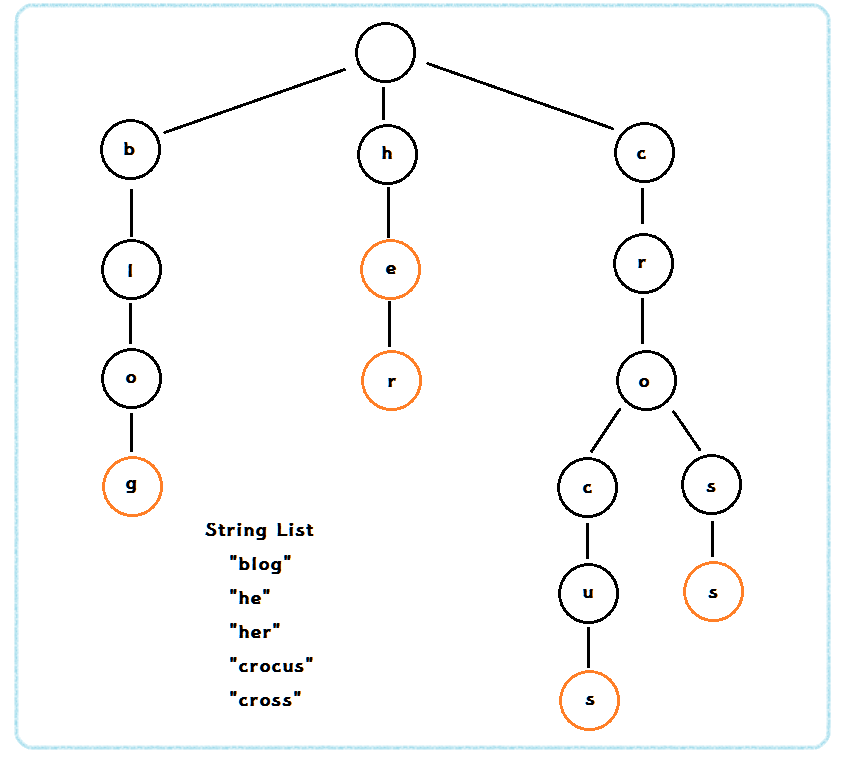

# 트라이(Trie)

- 문자열에 특화된 자료구조로서 문자열 집합을 표현하는 트리 자료구조 입니다.

- 우리가 원하는 원소를 찾는 작업을 O(n)에 해결할 수 있는 자료구조 입니다.

- 루트를 제외한 노드의 자손들은 해당 노드와 공통 **접두어**를 가지고 있습니다.

- Trie는 자식노드를 맵<key, value> 형태로 가지고 있습니다.

  - **Key**는 하나의 알파벳이 되고,  **Value**는 그 Key에 해당하는 자식노드가 됩니다.

  

### 1. 이해하기

- 우선 문자열 5개 {"blog", "he", "her", "crocus", "cross"}를 가지고 있다고 생각해봅시다.
- 루트 노드가 되는 가장 최상위 노드는 어떠한 단어도 들어가지 않습니다.
- 루트 아래 노드부터 문자열의 접두사가 하나씩 나타나게 됩니다.
- crocus는 찾으려면 c -> cr -> cro -> croc -> crocu -> crocus의 과정이 이루어지게 되고 이 과정에서 나타난 거들은 모두 crocus의 접두사가 됩니다. ( 그래서 접두사 트리라고도 불립니다. )
- 이러한 과정에서 시간복잡도는 문자열 길이만큼 시간이 가지게 됩니다. 원하는 단어를 찾을 때 O(str.length)의 시간만에 찾을 수 있다는 이야기 입니다.
- 물론 Map 등을 이용하며 비슷한 효과를 낼 수 있지만 Map은 이진 검색 트리 특성상 O(logN)의 시간이 발생하고 그 문자열을 확인하는 시간 만큼까지 포함하면 O(MlogN)만큼 시간이 걸리기 때문에 엄연히 시간복잡도가 다르게 됩니다.




### 2. 단점

- **공간복잡도**가 치명적인 단점으로 존재합니다.
- O(n)의 시간복잡도가 나오기 위해서는 다음 문자를 가리키는 노드가 필요합니다. 예를 들어 문제에서 숫자에 대해 트라이를 형성해야 한다면 0~9인 총 10개의 포인터 배열을 가져야하고 알파벳에 대해 트라이를 형성해야 한다면 a-z인 총 26개의 포인터 배열을 가지고 있어야 합니다.
- 최종적인 메모리는 **O(포인터 크기 \* 포인터 배열 개수 \* 트라이에 존재하는 총 노드의 개수)**가 됩니다.


### 3. 코드 구현

- 관련 문제 https://www.acmicpc.net/problem/5052

```java
import java.util.*;

class study9 {
	public static void main(String[] args) {
		Trie trie = new Trie();
		// insert 메서드

		trie.insert("PI");
		trie.insert("PIE");
		trie.insert("POW");
		trie.insert("POP");

		// Contains 메서드
		System.out.println(trie.contains("POW"));;
		System.out.println(trie.contains("PIE"));;
		// Delete 메서드
		trie.delete("POP");
		System.out.println(trie.contains("POP"));
		System.out.println(trie.contains("POW"));
		// 없는 단어를 지울 때 > 에러발생하는 예
		trie.delete("PO");
		trie.delete("PIES");
		trie.delete("PEN");
	}
}
class Trie{
	private TrieNode rootNode;

	public Trie() {
		this.rootNode = new TrieNode();
	}
	
	public void insert(String word) {
		TrieNode thisNode = this.rootNode;
		for (int i = 0; i < word.length(); i++) {
			// 해당 문자의 자식노드가 존재하지 않을 때에만 자식 노드를 생성해줍니다.
			TrieNode temp = new TrieNode();
			if(!thisNode.getChildNodes().containsKey(word.charAt(i))) {
				thisNode.getChildNodes().put(word.charAt(i), temp);
				thisNode = temp;
			}else {
				thisNode = thisNode.getChildNodes().get(word.charAt(i));
			}
		}
		thisNode.setLastChar(true);
	}
	
	public boolean contains(String word) {
		TrieNode thisNode = this.rootNode;
		
		for (int i = 0; i < word.length(); i++) {
			char c = word.charAt(i);
			TrieNode node = thisNode.getChildNodes().get(c);
			
			if(node==null) return false;
			
			thisNode = node;
		}
		
		//마지막이어야 제대로된 글자를 찾을 수 가 있습니다.
		return thisNode.isLastChar();
	}
	
	// 주어진 단어를 찾아 하위 노드로 내려갑니다.
	// 부모노드의 정보가 없기 때문에 하위 노드로 내려가며 삭제 대상 단어를 탐색하고 다시 올라오며 삭제하는 과정이 필요합니다.
	// 탐색(부모->자식), 삭제(자식->부모)
	public void delete(String word) {
		delete(this.rootNode, word, 0);
	}
	
	private void delete(TrieNode thisNode, String word, int index) {
		char c = word.charAt(index);
		
		//아예 단어가 없는 경우 에러 출력
		if(!thisNode.getChildNodes().containsKey(c)) {
			throw new Error("There is no [" + word + "] in this Trie.");
		}
		
		TrieNode childNode = thisNode.getChildNodes().get(c);
		index++;
		
		if(index == word.length()) {
			
			// 끝까지 탐색했는데 마지막 단어가 아닌경우는 존재하지 않는 것이니 에러 발생
			if (!childNode.isLastChar()) throw new Error("There is no [" + word + "] in this Trie.");
			
			childNode.setLastChar(false);

			// 삭제 대상 언어의 제일 끝으로써 자식 노드가 없으면(이 단어를 포함하는 더 긴 단어가 없으면) 삭제 시작
			// 중요한 것은 자식노드를 가지고 있으면 안됩니다.(다른 단어가 포함되어 있다는 의미니)
			if (childNode.getChildNodes().isEmpty()) {
				thisNode.getChildNodes().remove(c);
			}

		}else {
			delete(childNode, word, index);
			if(!childNode.isLastChar() && childNode.getChildNodes().isEmpty())
				thisNode.getChildNodes().remove(c);
		}

	}
	
}

class TrieNode {
	// 자식노드 맵
	private Map<Character, TrieNode> childNodes = new HashMap<>();
	
	//마지막 글자인지지 여부
	private boolean isLastChar;

	public Map<Character, TrieNode> getChildNodes() {
		return childNodes;
	}

	public boolean isLastChar() {
		return isLastChar;
	}

	public void setLastChar(boolean isLastChar) {
		this.isLastChar = isLastChar;
	}

	@Override
	public String toString() {
		return "TrieNode [childNodes=" + childNodes + ", isLastChar=" + isLastChar + "]";
	}
}
```

