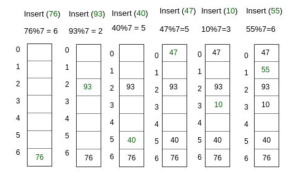
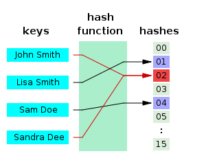
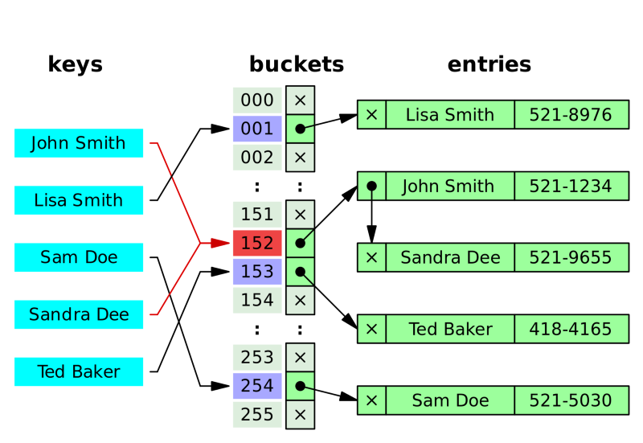
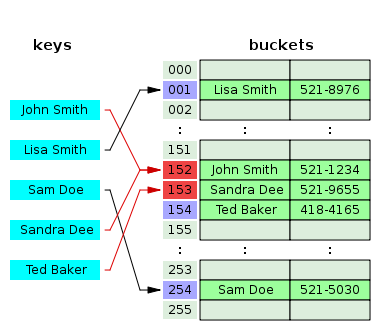

# 해시(Hash)

- 해시란 데이터를 다루는 기법 중에 하나로 **검색과 저장이 아주 빠르게** 진행됩니다. 아주 빠르게 진행될 수 있는 이유는 데이터를 검색할 때 사용할 key와 실제 데이터의 값이 (value가) 한 쌍으로 존재하고, key값이 배열의 인덱스로 변환되기 때문에 검색과 저장의 평균적인 시간 복잡도가 O(1)에 수렴하게 됩니다

  - 내부적으로 배열을 사용하여 데이터를 저장하기 때문에 빠른 검색 속도를 갖습니다. 특정한 값을 Search하는데 데이터 고유의 **인덱스**로 접근하기 때문입니다.

- 키에 대한 해시값을 사용하여 값을 저장하고 키-값 쌍의 갯수에 따라 동적으로 크기가 증가하는 **associate array** 입니다.

- 키에 대한 해시값을 구하는 과정을 **hashing(해싱)**이라고 하며 이때 사용하는 함수(알고리즘)를 해시함수 라고 합니다.

  - 인덱스로 저장되는 key값이 불규칙하기 때문에 특별한 알고리즘을 이용하여 저장할 데이터와 연관된 고유한 숫자를 만들어 낸 뒤 이를 인덱스로 사용합니다.

- 해시값 자체를 index로 사용하기 때문에 평군 시간복잡도가 O(1) 로 매우 빠릅니다.

  

### 1. 해시 테이블(Hash Table)

- 해시 테이블은 연관배열 구조를 이용해서 **키**에 **결과 값**을 저장하는 자료구조 입니다.
  - 연관배열 구조 : **키(key)** 1개와 **값(value)** 1개가 1:1로 연관되어 있는 자료구조입니다. 따라서 키(key)를 이용하여 값(value)을 도출할 수 있습니다.
- 해시 테이블의 구조 : 키(Key), 해시함수(Hash Function), 저장소(Bucket), 해시(Hash), 값(Value)로 이루어져 있습니다.
  - 키(Key) : 고유한 값이며 해시 함수의 input입니다. 다양한 길이의 값이 될 수 있고 이 상태로 최종 저장소에 저장이 되면 다양한 길이 만큼의 저장소를 구성해 두어야 하기 때문에 해시 함수로 값을 바꾸어 저장이 되어야 공간의 효율성을 추구할 수 있습니다.
  - 해시함수(Hash Function) : 키를 해시로 바꿔주는 역할을 합니다. 다양한 길이를 가지고 있는 키를 일정한 길이를 가지는 해시로 변경하여 저장소를 효율적으로 운영할 수 있도록 도와줍니다. 다만 서로 다른 키가 같은 해시가 되는 경우를 해시 충돌(Hash Collision)이라고 하는데, 해시 충돌을 일으키는 확률을 최대한 줄이는 함수를 만드는 것이 중요합니다.
  - 해시(Hash) : 해시 함수의 결과물이며 저장소에서 값과 매칭되어 저장됩니다.
  - 값(Value) : 저장소에 최종적으로 저장되는 값으로 키와 매칭되어 저장, 삭제, 검색, 접근이 가능해야 합니다.

### 좋은 Hash Function이란 ?

- **키**의 일부분을 참조하여 **해쉬 값**을 만들지 않고 **키 전체**를 참조하여 **해쉬 값**을 만들어 냅니다. 하지만 좋은 해쉬 함수는 키가 어떤 특성을 가지고 있느냐에 따라 달라지게 된다고 합니다.
- `hash function`를 무조건 1:1 로 만드는 것보다 **해시충돌**을 최소화하는 방향으로 설계하고 발생하는 **해시충돌**에 대비해 어떻게 대응할 것인가가 더 중요합니다.
- 1:1 대응이 되도록 만드는 것이 거의 불가능하기도 하지만 그런 `hash function`를 만들어봤자 그건 array 와 다를바 없고 메모리를 너무 차지하게 되는 것이죠.
- **해시충돌**이 많아질 수록 Search 에 필요한 시간복잡도가 O(1)에서 O(n)에 가까워진집니다.
- 어설픈 `hash function`는 hash 를 hash 답게 사용하지 못하도록 합니다. 좋은 `hash function`를 선택하는 것은 hash table 의 성능 향상에 필수적인 것이죠.
- 따라서 hashing된 인덱스에 이미 다른 값이 들어 있다면 세 데이터를 저장할 다른 위치를 찾은 뒤에야 저장할 수 있는 것입니다. 따라서 **충돌 해결**은 필수이며 그 방법들은 여러가지가 존재합니다.

### Insertion(저장)

- 해시 테이블에서 자료를 저장하려면 해시 함수로 키를 해시로 변경해야 합니다.
- 위의 사진처럼 input key를 7로 나눈 나머지로 변경해서 출력했을 때 키는 76, 해시는 6이 됩니다.
- 미리 준비해 놓은 0~6의 저장소에 맞는 해시값을 찾아 해당 값을 저장합니다.
- 해시를 산출하는 과정에서 서로 다른 key가 같은 hash로 변경되는 문제가 발생할 수 있는데 이는 **해시 충돌**이라고 부르며 key 와 value가 1:1로 매칭이 되어야 한다는 규칠을 위배한 것입니다.
- 시간 복잡도 : O(1)
  - 최악의 경우 O(n) : 해시 충돌로 인해 모든 Bucket의 Value들을 찾아봐야하는 경우도 있기 때문입니다.

### Deletion(삭제)

- 저장되어 있는 값을 삭제할 때는 저장소에서 해당 key와 매칭되는 값(value)를 찾아서 삭제하면 됩니다. 
  - 저장소에는 hash와 value가 함께 저장되어 있으므로 함께 지우면 됩니다.
- 시간 복잡도 : O(1), 키(key)는 고유하며 해시함수(hash function)의 결과로 나온 해시(hash)에 매칭되는 값(value)를 삭제하면 되기 때문입니다.
  - 최악의 경우 O(n) : 해시 충돌로 인해 모든 Bucket의 Value들을 찾아봐야하는 경우도 있기 때문입니다.

### Search(검색)

- 키(key)로 값(value)를 찾아내는 과정은 Deletion 과정과 비슷합니다. 
  - 키로 hash를 구한다. => hash로 값(value)를 찾는다.
- 시간 복잡도 : O(1)
  - 최악의 경우 O(n) : 해시 충돌로 인해 모든 Bucket의 Value들을 찾아봐야하는 경우도 있기 때문입니다.

### Hash Collision(해시 충돌)

- 무한한 값(해시테이블에서는 KEY를 의미)을 유한한 값(해시 테이블에서는 Hash를 의미)으로 표현하면서 서로 다른 두 개 이상의 유한한 값이 동일한 출력 값을 가지게 된다는 것입니다.
- 필연적으로 나타날 수 밖에 없습니다! ( 비둘기 집 원리 )

### Collision Resolution( 해결 방법 )

#### 1. Separate Chaining

- **Sandra**가 들어가면서 충돌이 발생하게 되는데 이것을 기존에 있던 **John**의 값에 연결시킵니다.

- **체이닝(Chaining)**은 자료 저장 시, **저장소(bucket)**에서 충돌이 일어나면 해당 값을 기존 값과 연결시키는 기법입니다.

- 이 때 **연결리스트(Linked List)** 자료구조를 사용합니다.

  - **Tree(Red-Black Tree)**를 사용하기도 합니다. 데이터의 개수가 적으면 링크드 리스트를 사용하는 것이 맞습니다. 트리는 기본적으로 메모리 사용량이 많기 때문이죠.
  - 데이터 개수가 적을 때 최악의 경우를 살펴보면 트리와 링크드 리스트의 성능 상 차이는 거의 없다고 합니다. 그래서 메모리 측면에서 봤을 때 데이터 개수가 적을 때는 링크드 리스트를 사용한다고 합니다.

- 장점

  - 한정된 저장소(Bucket)을 효율적으로 사용할 수 있습니다.
  - 해시 함수(Hash Function)을 선택하는 중요성이 상대적으로 적어집니다.
  - 상대적으로 적은 메모리를 사용하게 됩니다. 미리 공간을 잡아 놓을 필요가 없기 때문입니다.
  - Java에서 HashMap은 이 방법과 보조 해시 함수를 사용하고 있습니다.
    - Java 7 :  링크드 리스트, Java 8 : 슬롯(Slot)의 갯수가 8개 이하일 경우 연결 리스트(Linked List)를 사용하며 그 이상의 경우는 트리(Tree) 구조를 사용하여 검색의 효율을 높이고 있습니다.
    - 보조 해시 함수의 목적은 `key`의 해시 값을 변형하여 해시 충돌 가능성을 줄이는 것이입니다. `Separate Chaining` 방식을 사용할 때 함께 사용되며 보조 해시 함수로 Worst Case 에 가까워지는 경우를 줄일 수 있다고 합니다.

- 단점

  - 한 Hash에 자료들이 계속 연결되는**(쏠림 현상)** 현상이 발생하면 검색 효율이 낮아지게 됩니다.
  - 외부 저장 공간을 사용하게 됩니다. 그래서 외부 저장 공간 작업을 추가로 해야 합니다.

- 시간 복잡도 

  - 평균적으로 저장소에서 1개의 Hash 당 (m/n)개의 키가 들어 있습니다.

    - m : Key의 수, n : 해시 테이블의 저장소(Bucket) 길이

  - Insertion

    - 충돌이 발생했을 때 해당 해시(Hash)가 가진 연결리스트의 Head엣 자료를 저장할 경우 **O(1)**의 시간복잡도를 가지게 됩니다. 해당 **해시(Hash)**를 산출하고 저장하면서 기존 **값(Value)**를 연결하는 행위만 하면 되기 떄문입니다.

    - 반면 Tail에 자료를 저장할 경우, **O(m/n)**의 시간복잡도를 가지게 됩니다. 해당 **해시(Hash)**를 저장할 때 모든 연결리스트를 지나서 Tail에 접근해야 하기 때문입니다. 최악의 경우 **O(n)**의 시간 복잡도를 가지게 됩니다. 이유는 한개의 **해시(Hash)**에 모든 자료가 연결되어 있을 수 있기 때문이죠!

  - Deletion & Search

    - 산출된 **Hash**의 연결리스트를 차례로 살펴보아야 하므로 **O(m/n)**의 시간 복잡도를 가지게 됩니다. 최악의 경우 **O(n)**의 시간복잡도를 가지게 되는 것이죠. 한 개의 해시에 모든 자료가 연결되어 있을 수 있기 때문입니다.

#### 2. Open Addressing(개방주소법)

- **개방주소법**은 데이터의 **해시(Hash)**가 변경되지 않았던 **Chaining**과는 달리 비어있는 **해시(Hash)**를 찾아 데이터를 저장하는 기법입니다.
- **개방주소법**에서의 해시테이블은 1개의 **해시**와 1개의 **값(Value)**가 매칭되어 있는 형태로 유지됩니다.
- 위 그림을 보면, Sandra가 저장될 때 해시가 이미 John으로 들어가 있기 때문에 다음 Hash에 Sandra를 저장했습니다. 그리고 Ted의 해시도 Sandra가 저장되어 있기 때문에 그다음 해시에 Ted를 저장했습니다. 이처럼 비어있는 해시를 찾아 저장하는 방법을 **Open Addressing**이라고 합니다.

- 해시를  찾는 규칙
  - 선형 탐색(Linear Probing) : 다음 해시(+1)나 n개(+n)를 건너뛰어 비어있는 해시에 데이터를 저장
  - 제곱 탐색(Quadratic Probing) : 충돌이 일어난 해시의 제곱을 한 해시에 데이터를 저장
  - 이중 해시(Double Hashing) : 다른 해시함수를 한 번 더 적용한 해시에 데이터를 저장
- 장점
  - 또 다른 저장공간 없이 **해시테이블** 내에서 데이터 저장 및 처리가 가능하게 됩니다.
    - 또 다른 저장공간에서의 추가적인 작업이 없습니다.
- 단점
  - **해시 함수(Hash Function)**의 성능에 전체 해시테이블의 성능이 좌지우지됩니다.
  - 데이터의 길이가 늘어나면 그에 해당하는 저장소를 마련해 두어야 합니다.
- 시간 복잡도
  - 평균적으로 저장소에서 1개의 **Hash**당 1개의 **키**만 들어있기 때문에 (m/n)은 항상 1보다 작거나 같습니다.
    - m : Key의 수, n : 해시 테이블의 저장소(Bucket) 길이
  - **삽입**, **삭제**, **검색** 모두 대상이 되는 **Hash**를 찾아가는 과정에 따라 시간복잡도가 계산됩니다.
  - **해시함수**를 통해 얻은 **Hash**가 비어있지 않으면 다음 **버킷**을 찾아가야합니다. 이 찾아가는 횟수가 많아지면 많아질수록 시간복잡도는 증가하게 됩니다.
  - 최상의 경우 O(1), 최악의 경우 O(n)
  - **Open Addressing**은 비어있는 공간을 확보하는 것이 가장 중요합니다. 즉 저장소가 어느 정도 채워졌을 때 저장소의 사이즈를 늘려주는 것이죠.

### 3. Open Addressing vs Separate Chaining

- 두 방식 모두 최악의 경우에서 O(n)입니다. 하지만 `Open Address`방식은 연속된 공간에 데이터를 저장하기 때문에 `Separate Chaining`에 비해 캐시 효율이 높습니다.
- 따라서 데이터의 개수가 충분히 적다면 `Open Address`방식이 `Separate Chaining`보다 더 성능이 좋습니다.
  - 배열의 크기가 커지면(데이터 개수 증가) 캐시 적중률이 낮아셔 Chaining이 더 성능이 좋게 됩니다.
- `Separate Chaining`방식에 비해 `Open Address`방식은 버킷을 계속해서 사용합니다. 따라서 `Separate Chaining` 방식은 테이블의 확장을 보다 늦출 수 있다.

### Hash Table 자료구조의 단점

- 상하관계가 있거나, 순서가 중요한 데이터의 경우 Hash Table은 어울리지 않습니다. 순서와 상관없이 **key**만을 가지고 **hash**를 찾아 저장하기 때문입니다.
- **공간 효율성**이 떨어집니다. 데이터가 저장되기 전에 미리 저장공간을 확보해 놓아야 하기 때문입니다. 공간이 부족하거나 아예 채워지지 않은 경우가 생길 가능성이 있습니다.
- **Hash Function**의 의존도가 높습니다. 평균 데이터 처리의 시간복잡도는 **O(1)**이지만, 이는 해시 함수의 연산을 고려하지 않는 결과입니다. **해시함수**가 매우 복잡하다면 **해시테이블**의 모든 연산의 시간 효율성은 증가할 것입니다.

### Hash Table을 그래도 왜 사용할까?

- 해시충돌이 발생할 가능성이 있음에도 해시테이블을 쓰는 이유는 적은 리소스로 많은 데이터를 효율적으로 관리하기 위해서입니다. 
- 해시함수로 하드디스크나 클라우드에 존재하는 무한에 가까운 데이터(키)들을 유한한 개수의 해시값으로 매핑함으로써 작은 크기의 캐쉬 메모리로도 프로세스를 관리할 수 있게 됩니다.

- 색인(index)에 해시값을 사용함으로써 모든 데이터를 살피지 않아도 검색과 삽입/삭제를 빠르게 수행할 수 있습니다. .

- 해시함수는 언제나 동일한 해시값을 리턴하고, 해당 색인만 알면 해시테이블의 크기에 상관없이 데이터에 대단히 빠르게 접근할 수 있으며, 색인은 계산이 간단한 함수(상수시간)로 작동하기 때문에 매우 효율적입니다. 
  - 해시는 데이터 액세스(삽입, 삭제, 탐색)시 계산복잡성을 O(1)을 지향합니다.

- 해시테이블을 다른 자료구조와 비교해보겠습니다. 이진탐색트리와 그 변형의 경우 메모리를 효율적으로 사용하는 편이지만 데이터 탐색에 소요되는 계산복잡성은 O(logn)입니다. 배열(array)의 경우 데이터 탐색에 따른 계산복잡성은 O(1)이지만, 메모리를 미리 할당해 둬야 하기 때문에 공간 효율적이라고 말하기 어렵습니다.

### 예외) 해시 버킷 동적 확장(Resize)

- 해시 버킷의 개수가 적다면 메모리 사용을 아낄 수 있지만 해시 충돌로 인해 성능 상 손실이 발생하게 됩니다. 
- 그래서 HashMap 은 key-value 쌍 데이터 개수가 일정 개수 이상이 되면 해시 버킷의 개수를 두 배로 늘립니다. 
- 해시 버킷 크기를 두 배로 확장하는 임계점은 현재 데이터 개수가 해시 버킷의 개수의 75%가 될 때라고 합니다. 
  - `0.75`라는 숫자는 load factor 라고 불립니다.

